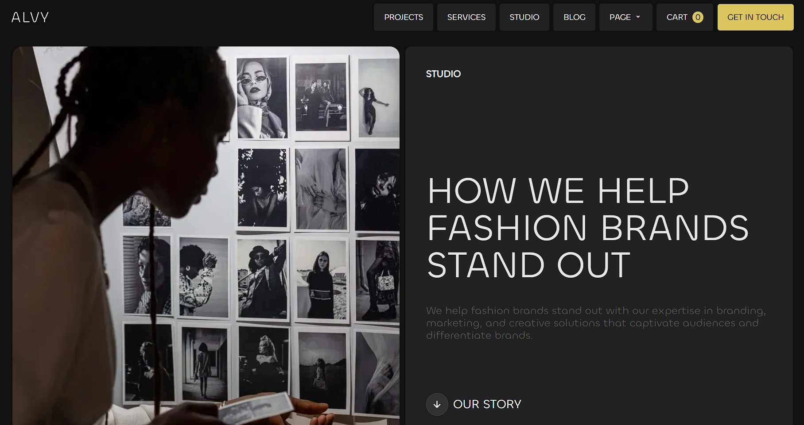

# 🌑 Alvy Clone

A clean, modern, and responsive landing page inspired by the **Alvy** website.  
Built using **HTML** and **SCSS**, this project focuses on an elegant layout, smooth styling, and seamless responsiveness across all screen sizes.

---
  
##🖼️ *Preview Screenshot:*  

---

## 🚀 Features
- 💻 Fully **responsive** design (mobile → 4K)  
- 🎨 Built with **SCSS** using mixins & clean structure  
- 🌗 **Dark theme** with gold accents  
- 🧩 **Grid + Flexbox** layout  
- ⚡ Smooth hover & UI transitions  
- 🧑‍💻 Sections included: Hero, Stats, Project, Team, Studio & Footer  

---

## 🧰 Tech Stack
- **HTML5**  
- **SCSS (SASS)**  
- **CSS Grid & Flexbox**

---

## ⚙️ How to Run Locally
1. **Clone this repo**
   ```bash
   git clone https://github.com/bilalsk111/alvy.clone.git
2. **Open the project**
   ```bash
   cd alvy.clone   
3. **Compile SCSS**
    ```bash
    sass styles/main.scss styles/main.css --watch
4. **Open in Browser**
   ```bash
   index.html
   
